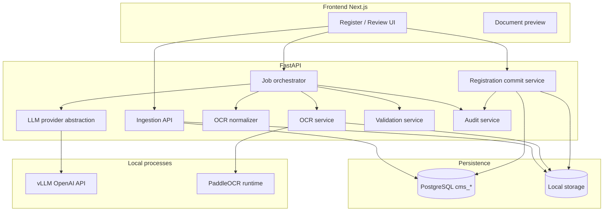

# AI-Assisted Letter Registration — Master Implementation Plan

**Status:** PROPOSED STATE (planning document)  
**Precondition:** Read `00-current-state.md`.

---

## 1. Concise assessment (current → target)

### Current architecture (summary)

Single-page Next.js CMS → FastAPI → PostgreSQL + local filesystem storage. Letters are registered manually; documents attach afterward. LLM integration exists but reads **letter metadata only**; no OCR; no approval gate before persistence.

### Target architecture (first phase)

```text
User uploads document (staging)
        ↓
Persist original file + create AiRegistrationJob (QUEUED)
        ↓
Background worker: OCR → raw artifact (ocr-output.json)
        ↓
Normalize OCR → llm-input.json (page-aware text)
        ↓
LLM provider (vLLM / Qwen3-8B default) → extraction-result.json (structured, untrusted)
        ↓
Pydantic + business validation → validated proposal (NEEDS_REVIEW)
        ↓
Human review UI (document left, fields right) → edited proposal
        ↓
Explicit APPROVE → POST creates cms_letters + cms_documents + links job to letter
        ↓
Audit records + retained artifacts for traceability
```

**Invariants:**

- PostgreSQL remains system of record for registered letters.
- LLM never writes SQL or calls DB directly.
- No vector DB in phase 1.
- Artifacts stored by ID (filesystem + JSON columns / artifact tables) for future embeddings/RAG.

---

## 2. Dependency map



| Dependency | Type | Required for | Notes |
|------------|------|--------------|-------|
| PostgreSQL 16+ | Infra | All | Existing |
| Python 3.11+ | Infra | Backend | Existing |
| Node/pnpm | Infra | Frontend | Existing |
| vLLM | Local service | LLM extraction | User-installed; separate port from API |
| Qwen3-8B weights | Model files | LLM | Download step in spec `04-llm-provider.md` |
| PaddleOCR (+ optional pdf2image/PyMuPDF) | Python libs | OCR | **New** — recommended |
| httpx | Python | LLM client | Existing |
| (Optional) pdf.js or iframe preview | Frontend | Review UI | Existing preview API may suffice |

---

## 3. Recommended implementation sequence (14 steps)

Each step maps to a spec file and produces a **verifiable artifact**.

| Step | ID | Spec | Primary artifact |
|------|-----|------|------------------|
| 0 | Model & vLLM smoke test | `specs/04-llm-provider.md` | curl/OpenAI client response + `/api/ai/status` |
| 1 | Config & provider abstraction | `specs/04-llm-provider.md` | Unit test: `vllm` provider configured without cloud key |
| 2 | DB schema for jobs & audit | `specs/09-audit-traceability.md`, `10-background-processing.md` | Migration/query shows empty tables |
| 3 | Staged file ingestion (no letter yet) | `specs/01-file-ingestion.md` | Uploaded file + `cms_ai_staged_documents` row |
| 4 | Job API + state machine | `specs/10-background-processing.md` | Job in `QUEUED` → API returns job id |
| 5 | OCR pipeline | `specs/02-ocr.md` | `storage/ai/{job_id}/ocr-output.json` |
| 6 | OCR normalization | `specs/03-ocr-normalization.md` | `llm-input.json` with page markers |
| 7 | Structured extraction prompts + schema | `specs/05-structured-extraction.md` | `extraction-result.json` |
| 8 | Validation layer | `specs/06-validation.md` | `validation-result.json` with pass/fail per field |
| 9 | Background worker wiring | `specs/10-background-processing.md` | Job reaches `NEEDS_REVIEW` asynchronously |
| 10 | Human review API | `specs/07-human-review.md` | GET proposal; PATCH edits; no letter yet |
| 11 | Review UI | `specs/07-human-review.md` | Manual: edit field → saved in proposal |
| 12 | Approval → registration commit | `specs/08-registration.md` | `cms_letters` row + linked document + job `REGISTERED` |
| 13 | Security hardening & tests | `specs/11-security.md`, `12-testing-and-acceptance.md` | pytest + security cases green |
| 14 | E2E acceptance | `specs/12-testing-and-acceptance.md`, `13-sample-test-data.md` | Full pipeline on fixture PDF |

Steps 0–1 can run in parallel with step 2; OCR (5–6) depends on 3–4; LLM (7) depends on 0–1 and 6; UI (11) depends on 10.

---

## 4. Step detail template (all steps follow this)

For each step, the corresponding spec contains sections A–M. Below is the master-plan rollup.

### Step 0 — vLLM + Qwen3-8B verification (pre-application)

- **Objective:** Prove local inference before coding extraction.
- **Why:** Model not downloaded yet; port/config risks.
- **Files:** None in app; update `backend/.env.example` only when implementing step 1.
- **Dependencies:** vLLM CLI, GPU/CPU RAM sufficient for 8B.
- **Security:** vLLM bound to localhost only.
- **Verification:** Documented curl + `GET /v1/models` — see `specs/04-llm-provider.md` § L.
- **Rollback:** N/A (no app change).

### Step 1 — LLM provider abstraction extension

- **Objective:** Support `LLM_PROVIDER=vllm` with OpenAI-compatible client; health probe.
- **Files (proposed):** `backend/app/llm_client.py`, `backend/app/config.py`, `backend/app/ai/llm_provider.py` (new module), `backend/tests/test_llm_provider.py`.
- **DB impact:** None.
- **API impact:** Optional `GET /api/ai/health/llm`.
- **Acceptance:** With vLLM running, health returns `ok` and test prompt returns JSON.

### Step 2 — Database schema

- **Objective:** Tables for staged uploads, jobs, OCR/extraction artifacts, approval audit.
- **Files:** `backend/app/models.py`, `backend/app/db_upgrade.py` or Alembic (prefer existing `db_upgrade` pattern).
- **Proposed tables:** See § 5 below.
- **Acceptance:** SQL `SELECT COUNT(*) FROM cms_ai_registration_jobs` works.

### Step 3 — File ingestion

- **Objective:** Accept PDF/image upload without `letter_id`; virus-safe validation reusing `storage_service` rules.
- **Files:** `backend/app/routers/ai_registration.py`, `backend/app/ai/ingestion_service.py`, `frontend/services/ai-registration.ts`.
- **Artifact:** Staged document record + file on disk under `storage/ai/staging/…`.

### Step 4 — Job creation & status API

- **Objective:** `POST /api/ai-registration/jobs` enqueues processing.
- **States:** `QUEUED`, `PROCESSING`, `OCR_COMPLETE`, `EXTRACTION_COMPLETE`, `NEEDS_REVIEW`, `APPROVED`, `REGISTERED`, `FAILED`, `REJECTED`.
- **Artifact:** Job row with timestamps and error fields.

### Step 5 — OCR

- **Objective:** Produce page-level raw OCR JSON; retain either original file path or staged path.
- **Artifact:** `ocr-output.json` (see spec schema).

### Step 6 — Normalization

- **Objective:** Build LLM context with explicit page boundaries; keep raw OCR immutable.
- **Artifact:** `llm-input.json` + optional `llm-input.txt`.

### Step 7 — Structured extraction

- **Objective:** Versioned prompt + Pydantic schema mapped to `LetterCreate` fields + extensions (`summary`, `relatedReferences`, evidence).
- **Artifact:** `extraction-result.json`.

### Step 8 — Validation

- **Objective:** Master data checks (department, priority, type), date parsing, required fields, duplicate `number` pre-check.
- **Artifact:** `validation-result.json`; job status `NEEDS_REVIEW` or `FAILED`.

### Step 9 — Background worker

- **Objective:** Extend `jobs.py` pattern — worker thread dequeuing `QUEUED` jobs (same process as API for minimal infra).
- **Why not Celery:** No Redis in repo; import jobs use DB + inline processing; thread worker matches reminder scheduler.
- **Acceptance:** Upload returns immediately; job transitions without blocking HTTP request.

### Step 10 — Review API

- **Objective:** Fetch proposal, patch fields, reject, request re-run.
- **Security:** Job ownership by user/session (see open questions); no registration on PATCH.

### Step 11 — Review UI

- **Objective:** Split view Register Letter flow: “Upload & analyze” path → review screen.
- **Files:** New component e.g. `frontend/components/ai/registration-review.tsx`; extend `Register()` or new page state.

### Step 12 — Registration commit

- **Objective:** `POST …/approve` calls existing letter creation logic + document attach + relations optional.
- **Artifact:** Letter id in DB; job `letter_id` set; query proves no letter before approve.

### Step 13 — Security & automated tests

- **Objective:** Prompt injection fixtures, XSS escaping in UI, size/type limits, authz tests.
- **Files:** `backend/tests/test_ai_registration_*.py`.

### Step 14 — E2E acceptance

- **Objective:** One command/script runs pipeline on `fixtures/ai-letter-registration/sample-01-typed-letter.pdf`.
- **Evidence:** Screenshot optional; SQL + JSON artifacts required.

---

## 5. Proposed database schema changes

**PROPOSED STATE** — not applied until implementation step 2.

### `cms_ai_staged_documents`

| Column | Type | Purpose |
|--------|------|---------|
| id | PK | |
| original_filename | varchar | |
| mime_type, file_size, checksum | | Integrity |
| storage_key | varchar | Staging path |
| uploaded_by | varchar | |
| created_at | timestamptz | |

### `cms_ai_registration_jobs`

| Column | Type | Purpose |
|--------|------|---------|
| id | PK | `ai_job_id` exposed to UI |
| staged_document_id | FK | Source file |
| letter_id | FK nullable | Set only after REGISTERED |
| status | varchar | State machine |
| error_code, error_message | | Failure |
| ocr_artifact_key | varchar | Path to raw OCR JSON |
| normalized_artifact_key | varchar | llm-input |
| extraction_artifact_key | varchar | |
| validation_artifact_key | varchar | |
| proposal_json | text | Latest merged proposal for review |
| prompt_version, model_id, model_config_json | | Traceability |
| created_by, reviewed_by, approved_by | varchar | |
| created_at, updated_at, completed_at | | |

### `cms_ai_runs` (optional split — or embed in job)

For multiple LLM retries / re-runs: run id, job id, input hash, output JSON, latency, status.

### `cms_ai_field_evidence` (optional normalized)

field_name, page, snippet, bbox_json, confidence — enables UI “source” links.

**Future compatibility:** `staged_document_id` and page-indexed OCR JSON are stable inputs for later pgvector chunk table without redesign.

---

## 6. Proposed extraction ↔ letter field mapping

| Extraction field | Letter column / behavior | Human confirm? |
|------------------|--------------------------|----------------|
| number | `number` | Yes — duplicate check |
| letterDate | `letter_date` | Yes if ambiguous |
| receivedDate | `received_date` | Often default to today |
| type | `type` | Yes — master data |
| subject | `subject` | Yes |
| from / sender | `sender` | Yes |
| to / recipient | `recipient` | Yes |
| department | `department` | Yes — must match master |
| priority | `priority` | Yes |
| dueDate | `due_date` | Yes if inferred |
| actionRequired | `action_required` | Yes |
| confidentiality | `confidentiality` | Yes |
| remarks | `remarks` | Optional |
| summary | **New:** store in `proposal_json` only OR add `summary` column — **DECISION REQUIRED** | Display in UI; optional DB column later |
| documentCategory | Map to upload `document_type` | Yes |
| relatedLetterNumbers | Create `cms_letter_relations` post-commit | Yes |
| evidence/confidence | Not stored on letter — audit artifacts only | |

---

## 7. Proposed new files (implementation phase)

### Backend

- `backend/app/routers/ai_registration.py`
- `backend/app/ai/__init__.py`
- `backend/app/ai/ingestion_service.py`
- `backend/app/ai/ocr_service.py`
- `backend/app/ai/ocr_normalize.py`
- `backend/app/ai/extraction_schema.py`
- `backend/app/ai/extraction_service.py`
- `backend/app/ai/validation_service.py`
- `backend/app/ai/registration_commit.py`
- `backend/app/ai/job_worker.py`
- `backend/app/ai/llm_provider.py`
- `backend/app/ai/prompts/registration_v1.txt`
- `backend/tests/test_ai_registration_ingestion.py`
- `backend/tests/test_ai_registration_ocr.py`
- `backend/tests/test_ai_registration_extraction.py`
- `backend/tests/test_ai_registration_validation.py`
- `backend/tests/test_ai_registration_e2e.py`
- `backend/scripts/run_ai_job.py` (CLI debug)
- `backend/scripts/verify_vllm.py`

### Frontend

- `frontend/services/ai-registration.ts`
- `frontend/components/ai/registration-upload.tsx`
- `frontend/components/ai/registration-review.tsx`

### Fixtures

- `fixtures/ai-letter-registration/README.md`
- `fixtures/ai-letter-registration/sample-*.pdf` (generated placeholders — see spec 13)
- `fixtures/ai-letter-registration/expected/*.json` (golden outputs, partial)

### Docs (this planning phase)

Already under `docs/ai-letter-registration/`.

---

## 8. Proposed modified files (implementation phase)

| File | Change summary |
|------|----------------|
| `backend/app/models.py` | New AI tables |
| `backend/app/db_upgrade.py` | Create/alter AI tables |
| `backend/app/config.py` | OCR paths, vLLM, worker toggles |
| `backend/app/main.py` | Register router; start AI worker |
| `backend/app/jobs.py` | AI worker thread |
| `backend/app/llm_client.py` | vLLM provider, retries, logging redaction |
| `backend/.env.example` | vLLM, OCR, AI storage |
| `backend/requirements.txt` | OCR + PDF deps |
| `frontend/app/page.tsx` | Register flow: AI path + review route |
| `frontend/components/ai/letter-tools.tsx` | Deprecate/mock note for old analyze path (optional) |

**Do not modify** existing `/api/letters` contract behavior for manual registration.

---

## 9. New dependencies (proposed)

### Python (pin versions during implementation)

| Package | Purpose |
|---------|---------|
| `paddleocr` | Local OCR (recommended) |
| `paddlepaddle` | OCR backend (CPU/GPU variant per environment) |
| `pymupdf` or `pdf2image` | PDF → images for OCR |
| `pillow` | Image handling |
| `jsonschema` or pydantic only | Validation (prefer Pydantic v2 already via FastAPI) |

**ASSUMPTION:** PaddleOCR chosen for offline/local alignment with vLLM; Tesseract acceptable fallback — document in `02-ocr.md`.

### Node

| Package | Purpose |
|---------|---------|
| None required if using existing preview iframe | |
| Optional `react-pdf` | Enhanced PDF UX — **OPEN QUESTION** |

---

## 10. Local development setup procedure

1. Start PostgreSQL; ensure `ailms` DB (auto-created on API start).
2. Backend venv: `pip install -r requirements.txt` (+ OCR extras after step 5).
3. Copy `backend/.env.example` → `.env`; set PostgreSQL credentials.
4. Start vLLM on port **8001** (avoid clash with API 8000):
   ```bash
   vllm serve Qwen/Qwen3-8B --host 127.0.0.1 --port 8001
   ```
   **Note:** Confirm exact Hugging Face model id at implementation time (e.g. `Qwen/Qwen3-8B` or `-Instruct` variant).
5. Configure backend:
   ```env
   LLM_PROVIDER=vllm
   LLM_BASE_URL=http://127.0.0.1:8001/v1
   LLM_API_KEY=EMPTY
   LLM_MODEL=Qwen/Qwen3-8B
   ```
6. Run API: `uvicorn app.main:app --reload --host 127.0.0.1 --port 8000`
7. Frontend: `pnpm install && pnpm dev` in `frontend/`.
8. After implementation: place test PDF in fixtures; run `python -m pytest backend/tests/test_ai_registration_e2e.py`.

---

## 11. Qwen3-8B / vLLM verification procedure (summary)

Full detail: `specs/04-llm-provider.md`.

1. Download model: `huggingface-cli download Qwen/Qwen3-8B` (or vLLM auto-download on first serve).
2. Start vLLM; `curl http://127.0.0.1:8001/v1/models`.
3. Chat completion with known prompt; expect non-empty JSON/text.
4. Run `backend/scripts/verify_vllm.py` (to be added) — exits 0.
5. After FastAPI wiring: `GET /api/ai/health/llm` returns `{ "status": "ok", "model": "…" }`.

For Qwen3 reasoning mode: disable thinking for structured JSON via `extra_body` / chat template kwargs per vLLM docs.

---

## 12. End-to-end verification procedure (summary)

Full detail: `specs/12-testing-and-acceptance.md`.

1. Upload `fixtures/ai-letter-registration/sample-01-typed-letter.pdf`.
2. Poll job until `NEEDS_REVIEW`.
3. Assert artifacts exist on disk: `ocr-output.json`, `llm-input.json`, `extraction-result.json`.
4. Open review UI; change `subject`; approve.
5. SQL: `SELECT id, number, subject FROM cms_letters ORDER BY id DESC LIMIT 1` matches edited subject.
6. SQL: `SELECT letter_id, status FROM cms_ai_registration_jobs WHERE id = ?` → `REGISTERED`, non-null `letter_id`.
7. SQL: confirm no `cms_letters` row created between upload and approve (test uses transaction/time window or asserts job created before letter).

---

## 13. Known risks and unresolved decisions

| ID | Risk / question | Mitigation / note |
|----|-----------------|-------------------|
| R1 | vLLM port 8000 conflicts with FastAPI | Use 8001+ for vLLM |
| R2 | 8B model RAM/VRAM | Quantization / smaller fallback for dev |
| R3 | PaddleOCR install size on Windows | Document CPU-only install; WSL optional |
| R4 | No real API authentication | Scope jobs by `created_by`; add auth middleware later |
| R5 | Qwen3 JSON + reasoning output | Disable thinking; strict JSON schema + repair pass |
| R6 | OCR quality on Urdu/Arabic | **OPEN QUESTION** — multilingual model selection |
| D1 | Draft letter row vs staged document only | **Recommend staged document only** until approve |
| D2 | Store `summary` on letter table | Defer column; keep in proposal JSON first |
| D3 | Separate microservice for OCR | Defer; in-process for phase 1 |
| D4 | Letter number auto-generation | **OPEN QUESTION** — manual vs sequence |

---

## 14. Future compatibility (not in scope)

Retain: document checksums, page-level OCR, job/run IDs, prompt versions, normalized text chunks — enables pgvector, RAG, Outlook ingestion, agents without re-ingesting originals.

---

## 15. Rollback strategy (per phase)

- **Schema:** `db_upgrade` down scripts or manual `DROP TABLE` for AI tables only (letters untouched).
- **Feature flag:** `AI_REGISTRATION_ENABLED=false` in config — hide UI and return 404 on API.
- **Worker:** Stop thread via config; jobs remain resumable from last status.

See `TRACEABILITY.md` for requirement mapping.
